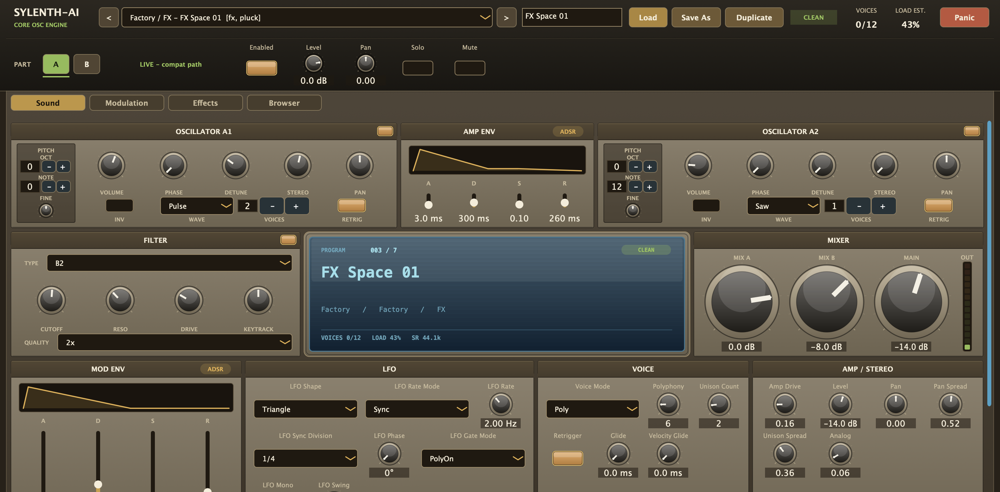

# sylenth-ai



sylenth-ai is a lab-built macOS software instrument project. The product goal is to rebuild everyone's favorite vintage VST, Sylenth1, optimized for today's macOS/Ableton workflow, then extend that foundation with AI-assisted sound design and conversational editing.

## Product Roadmap

Phase 1: recreate the Sylenth experience. The first milestone is a modern AU/VST3 instrument with Sylenth-level immediacy: A/B architecture, fast oscillator/filter/envelope/modulation access, a strong preset workflow, arpeggiator/effects coverage, and Ableton validation. The manual in `Sylenth1Manual.pdf`, the screenshot corpus in `research/sylenth1-screenshots/`, and `docs/modern-sylenth-baseline.md` drive product decisions for this phase.

Phase 2: add AI-assisted sound and arpeggio creation. The plugin should be able to randomize and generate useful sounds, chord movement, and arpeggio ideas with the musical intent of tools like Xfer Records' Cthulhu, while keeping all generated state as normal editable presets and parameters.

Phase 3: make the VST conversational. Users should be able to ask for changes in plain language, for example "make the bass wubbier," or provide a reference sound and ask sylenth-ai to recreate the character with editable synth, modulation, arp, and FX settings.

## Current State

The repo builds a JUCE/CMake instrument scaffold with:

- AU, VST3, and standalone targets.
- A dry-core DSP path with oscillator, filter, envelopes, LFO, ramp, glide, velocity glide, amp drive, pan/spread, and performance MIDI sources.
- A bypassable post-voice FX path with saturation, tempo-synced delay, simple reverb, chorus, and realtime/offline quality settings.
- An 8-slot TransMod-style modulation layer with source/scaler routing and physical destination depths.
- A Phase 1 A/B layer and four oscillator-slot backbone in host/preset state; Layer A maps to the current sound path and Layer B is valid but disabled by default.
- Factory presets, preset schema validation, MIDI fixture rendering, and JSON report generation.
- A registry-bound editor with factory/user preset load-save-duplicate workflow, TransMod slot editing, and diagnostics.
- Core validation for oscillator/filter behavior, modulation routing, voice allocation, dry/wet renders, render determinism, and preset loading.

Phase 1 host validation in Ableton is underway: current proof covers AU/VST3 scan-load-play smoke, current VST3 rescan/create/play, AU/VST3 Live-set state restore, VST3 transport run/stop, VST3 offline bounce artifact creation, AU transport run/stop with the hosted AU editor visible, AU/VST3 hosted editor open/close/reopen while transport runs, VST3 learned-CC capture/persistence, and VST3 continuous controller value application. Remaining validation covers automation, AU learned controller mapping/value application, VST3 host Forget and stepped controller playback, preset/modulation exercise, offline-versus-realtime comparison, sample-rate/buffer changes, all-notes-off, and panic.

## Build

Configure:

```bash
cmake -S . -B build -DSYLENTH_AI_ENABLE_TESTS=ON
```

Build:

```bash
cmake --build build --config Debug
```

Run tests:

```bash
ctest --test-dir build --output-on-failure
```

Build artifacts are written under:

- `build/SylenthAIPlugin_artefacts/Standalone/sylenth-ai.app`
- `build/SylenthAIPlugin_artefacts/AU/sylenth-ai.component`
- `build/SylenthAIPlugin_artefacts/VST3/sylenth-ai.vst3`

The default build fetches JUCE `8.0.13`. Set `SYLENTH_AI_JUCE_PATH=/path/to/JUCE` during configure to use a local JUCE checkout. The previous `SYNTH_*` CMake options are still accepted as compatibility aliases.

## Validation

Run the full standalone core suite:

```bash
./build/SylenthAIRender --suite core --output-dir build/reports/core
```

Focused validation commands:

```bash
./build/SylenthAIRender --smoke --output build/reports/smoke.json
./build/SylenthAIRender --list-parameters --output build/reports/parameters.json
./build/SylenthAIRender --validate-presets presets/factory --output build/reports/presets.json
./build/SylenthAIRender --voice-test --output build/reports/voice-core.json
./build/SylenthAIRender --osc-test --notes C1,C3,C5,C7 --output build/reports/oscillator.json
./build/SylenthAIRender --filter-test --output build/reports/filter.json
./build/SylenthAIRender --modulation-test --fixture fixtures/midi/overlap-pluck.mid --output build/reports/modulation.json
```

Render the factory dry-core pluck:

```bash
./build/SylenthAIRender \
  --preset presets/factory/pluck-core-01.json \
  --fixture fixtures/midi/overlap-pluck.mid \
  --dry \
  --output build/renders/pluck-core-01-dry.wav \
  --report build/reports/pluck-core-01-dry.json
```

Render the factory wet pluck:

```bash
./build/SylenthAIRender \
  --preset presets/factory/pluck-core-01.json \
  --fixture fixtures/midi/overlap-pluck.mid \
  --wet \
  --output build/renders/pluck-core-01-wet.wav \
  --report build/reports/pluck-core-01-wet.json
```

Current core validation covers:

- finite output and non-clipping dry renders,
- oscillator tuning, pulse width, sub octave, stack detune, noise, and hard sync,
- semitone-domain filter mapping and nonlinear filter stability,
- ramp timing, glide, velocity glide, and mono/legato/unison allocation edge cases,
- direct modulation and TransMod source/scaler/destination behavior,
- top-level preset `mod_slots` schema loading and strict depth validation,
- FX bypass equivalence, tempo-synced delay at test tempo, FX tail reporting, wet render finite-output safety, and serialized realtime/offline quality settings,
- deterministic render repeatability and LFO ablation metrics.

## Developer Handoff

Use this when continuing development on another Mac, especially one with Ableton installed.

Clone the private repo:

```bash
git clone https://github.com/ParkerRex/sylenth-ai.git
cd sylenth-ai
```

Build and validate locally:

```bash
cmake -S . -B build -DSYLENTH_AI_ENABLE_TESTS=ON
cmake --build build --config Debug
ctest --test-dir build --output-on-failure
./build/SylenthAIRender --suite core --output-dir build/reports/core
scripts/check-plugin-bundles.sh build
```

Install the locally built AU and VST3 into the per-user macOS plug-in folders:

```bash
scripts/install-local-plugins.sh build
```

Preview or remove the local install:

```bash
scripts/uninstall-local-plugins.sh --dry-run
scripts/uninstall-local-plugins.sh
```

Local install and Ableton scan troubleshooting live in `docs/host-validation/local-install-troubleshooting.md`.

Open the Ableton smoke template and record the environment before testing:

```bash
open docs/host-validation/ableton-smoke.md
```

Fill in:

- date,
- machine,
- macOS version,
- Ableton version,
- repo commit from `git rev-parse --short HEAD`,
- build directory, usually `build`,
- sample rate,
- buffer size,
- plugin format tested: AU, VST3, or both.

In Ableton:

- Enable Audio Units and VST3 in Ableton's Plug-Ins settings.
- Rescan plug-ins after running `scripts/install-local-plugins.sh build`.
- Confirm `sylenth-ai` appears in the AU plug-in list.
- Confirm `sylenth-ai` appears in the VST3 plug-in list.
- Load the AU build on a MIDI track.
- Load the VST3 build on a separate MIDI track.
- Play `fixtures/midi/overlap-pluck.mid` or an equivalent overlapping-note pluck pattern.
- Confirm both formats produce finite audible output.
- Exercise mono, mono-legato, poly, unison, glide, velocity glide, ramp, and TransMod behavior.
- Record and replay one parameter automation lane.
- Save the Live set, close Ableton, reopen it, and confirm state restore.
- Export a short bounce if playback and restore pass.

If something fails, write it into `docs/host-validation/ableton-smoke.md` with:

- plugin format,
- exact step,
- expected result,
- actual result,
- whether it reproduces,
- Ableton log path or relevant message,
- linked fix commit once fixed.

## Repository Map

- `SPEC.md`: durable product requirements.
- `CONTEXT.md`: project vocabulary and decision lanes.
- `docs/ARCHITECTURE.md`: implementation architecture.
- `docs/VALIDATION.md`: validation strategy and report contract.
- `docs/modern-sylenth-baseline.md`: Phase 1 Sylenth rebuild baseline and roadmap.
- `research/sylenth1-screenshots/SOURCE_INDEX.md`: traceable source map for the local Sylenth screenshot corpus.
- `src/dsp/`: DSP engine, oscillator, filter, envelopes, LFO, ramp, FX, and parameters.
- `src/voice/`: voice rendering and allocation.
- `src/plugin/`: JUCE processor/editor and parameter registry.
- `src/presets/`: preset schema validation.
- `src/validation/`: standalone render and report CLI.
- `tests/smoke/`: CTest smoke, contract, voice, and DSP coverage.
- `presets/factory/`: factory presets.
- `fixtures/`: MIDI and preset fixtures used by validation.
